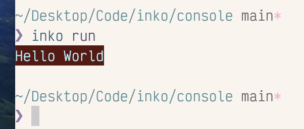
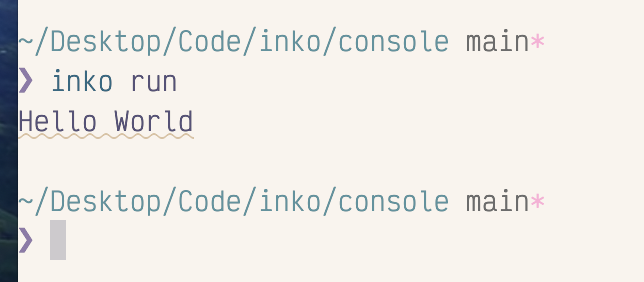
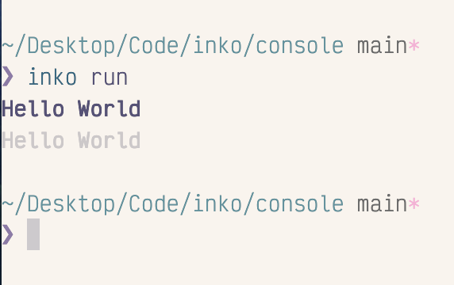
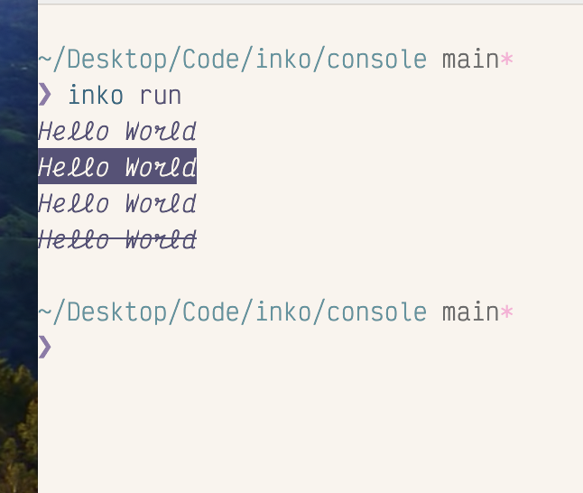
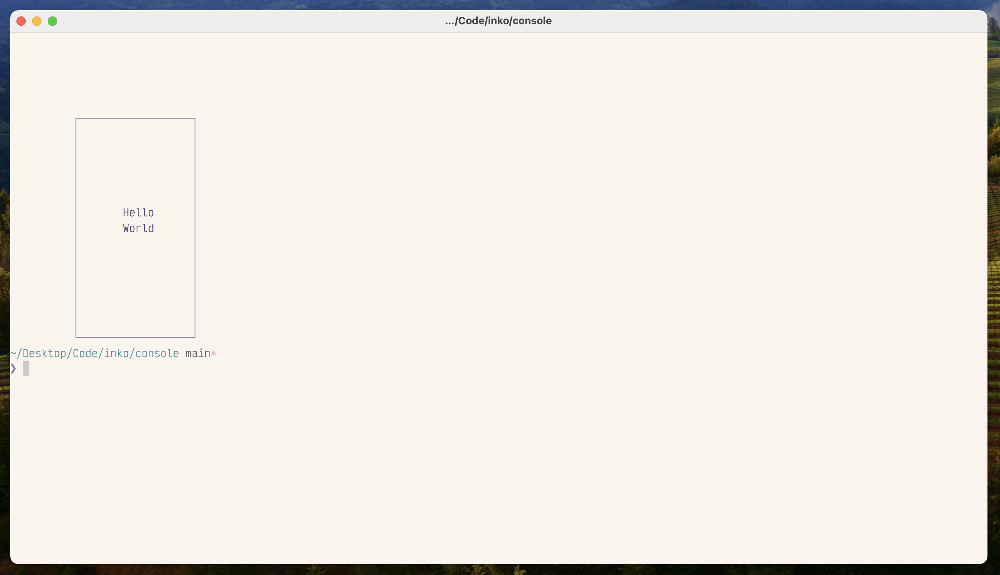

# Inko Console

This is a small library for working with text displays in Inko programs.

For the most part it is a combination of a lightweight wapper of ANSI escape codes called Console,
and a heavyweight wrapper of that lightweight wrapper called Tui (short for Terminal UI).

For now you can ignore Tui, since all it does is display framed panels. I'm planning to add
some other widgets later, but I need time to better research the escape codes.

I've only tested this in the Kitty Terminal for several reasons:

* It's what I use so it was easy to test. 😛
* The author and maintainer of Kitty is opinionated and pedantic about "correct" escape codes.
  I don't always agree with his opinion, but I choose to follow it so I don't have to have form my own opinions.
* He coordinates with other terminal maintainers to try to have a "most standard" interpretation of the escape sequences.  

## Status

This is super early release alpha software. Most things don't work. Things that do work probably don't work properly.
Things that do work properly on Kitty probably don't work properly on other terminals.

## Console

This library ships with a `console::Console` class that you may want to think of as
"STDOUT, but with rich text capabilities."

To instantiate a new console:

```
import console::Console

class async Main {
  fn async main {
    let console = Console.new
  }
}```




### Colors

You can set foreground and background colors using the console's `foreground` and `background`
methods, passing in a `console::ansi::Color` object, which is a wrapper of
RGB colour tuples:

```
import console::Console
import console::ansi::Color

class async Main {
  fn async main {
    let console = Console.new
    console.background(Color.new(90, 20, 14))
    console.foreground(Color.new(180, 240, 255))
    console.print("Hello World") 
  }
}
```

The console currently ONLY supports true colour (RGB) values. The traditional
4/8/16/256-bit palettes aren't currently supported. This is partially because
I was lazy/not interested in supporting them and partially because it's been at least
a decade since terminals didn't support 256-color. 

### Underline styles

(Some) modern terminals support multiple underline styles, and in these terminals
you can set the underline colour independently of the rest of the style. The ansi
module contains a `Underline` enum for the various styles that (might be) supported
and the `Console` class has an `underline` method that accepts a style and color:

```
import console::Console
import console::ansi::(Color, Underline)

class async Main {
  fn async main {
    let console = Console.new
    console.underline(Underline.Curly, Color.new(220, 194, 162))
    console.print("Hello World")
  }
}```



### Brightness (Bold) styles

My biggest learning from this project is that terminals are weird and
steeped in a history from teletype and CRT days. I remember CRTs, but I don't
remember teletype (I saw a running one in a museum once, though. That was cool).

Where all other widget and formatting systems portray bold as "like italic but for strong text",
terminals sort of abused what used to be called "bright" to mean "bold". Then they also
added a "faint" or "dim" color setting and can't be combined. This made sense with CRTs,
but less sense with the true color LCD displays we have today. Still, the artefact exists
and I decided to embrace it. 

```
import console::Console
import console::ansi::(Color, Brightness)

class async Main {
  fn async main {
    let console = Console.new
    console.brightness(Brightness.Bold)
    console.print("Hello World")
    console.brightness(Brightness.Dim)
    console.print("Hello World")
  }
}
```



### Various On/Off Styles

Some terminals support some combination of italic, strikethrough, and inverted styles as well. These
can be accessed from the `style` function. This function accepts a style which is technically
an enum but has constructors for flipping the style on or off:

```
import console::Console
import console::ansi::(Color, Style)

class async Main {
  fn async main {
    let console = Console.new
    console.style(Style.italic)
    console.print("Hello World")
    console.style(Style.invert)
    console.print("Hello World")
    console.style(Style.invert_off)
    console.print("Hello World")
    console.style(Style.strike)
    console.print("Hello World")
  }
}```




### Combining and resetting styles

All three of the above styles are set until they are explicitly disabled.
So if you want something in italics and bold with a weird background color:

```
import console::Console
import console::ansi::(Color, Underline, Brightness, Style)

class async Main {
  fn async main {
    let console = Console.new
    console.style(Style.italic)
    console.brightness(Brightness.Bold)
    console.background(Color.new(255, 8, 252))
    console.print("hello world")
    console.reset
  }
}
```

The reset method is used to strip all styles. If you want to turn them off individual,
you'll need to apply the inverse style:

* `console.underline(Underline.None, Color.black)` to disable the underline style
* `console.brightness(Brightness.Normal)` to disable bold or dim styles
* `console.style(Style.[italic|invert|strike]_off)` to disable the basic styles

### Clearing the screen

Console comes with a `clear` method that accepts an `ansi.Clear` object depending
on whether you want to clear:

* From the cursor to the beginning of the screen: `Clear.ToStart`
* From the cursor to the end of the screen `Clear.ToEnd`
* The entire screen `Clear.Screen`
* The entire screen and the scrollback buffer `Clear.Scrollback`

### Moving the cursor

Console has a `move` function that accepts an `ansi.Cursor` object to move the
cursor in various ways:

* `Cursor.Up(count)`
* `Cursor.Down(count)`
* `Cursor.Right(count)`
* `Cursor.Left(count)`
* `Cursor.MoveToColumn(column_number)`
* `Cursor.MoveTo(row_number, column_number)`

My intention is for these to not get a ton of use outside of the still-in-progress
TUI library.

## TUI

The terminal UI library is meant to provide composable widgets that use escape codes
to draw data on the screen. I haven't really thought this through yet (especially around
refreshes), and right now it just contains a panel class that allows you to write aligned
text inside a frame:

```
import tui::Tui
import tui::align::Alignment

class async Main {
  fn async main {
    let term = Tui.new
    term.clearScreen
    term.panel(5, 10, 20, 16, "Hello\nWorld", Alignment.Center)
  }
}```



Note that the `Tui` class also has public access to the `@console` field
to access the console methods described above.
